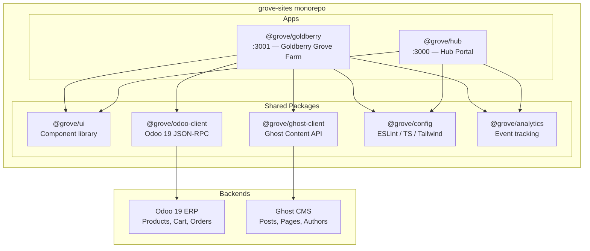

# grove-sites

[](https://github.com/Goldberry-Playground/grove-sites/actions/workflows/ci.yml)


Multi-tenant frontend monorepo for the **Gathering at the Grove** ecosystem -- a community of independent businesses (Goldberry Grove Farm, George George George Woodworking, At The Grove Nursery, LLC) sharing a headless Next.js 15 frontend backed by Odoo 19 ERP and Ghost CMS. Each tenant runs as its own Next.js app with isolated theming and configuration while consuming shared packages for UI components, API clients, analytics, and design tokens.

## Architecture



## Tech Stack

| Layer | Technology | Version |
| --- | --- | --- |
| Framework | Next.js (App Router) | ^15.2.0 |
| UI Library | React | ^19.0.0 |
| Language | TypeScript | ^5.7.0 |
| Styling | Tailwind CSS | ^4.0.0 |
| Monorepo | Turborepo | ^2.5.0 |
| Package Manager | pnpm | 9.15.0 |
| Node Runtime | Node.js | 22 |
| ERP Backend | Odoo | 19 (JSON-RPC /json2) |
| CMS Backend | Ghost | Content API v5.0 |

## Repository Structure

```
grove-sites/
├── apps/
│   ├── hub/                        # Hub portal — gatheringatthegrove.com
│   │   ├── app/
│   │   │   ├── layout.tsx          # Root layout with tenant theming
│   │   │   ├── page.tsx            # Landing page linking to tenant sites
│   │   │   └── globals.css
│   │   ├── tenant.config.ts        # Hub tenant identity and color tokens
│   │   ├── next.config.ts
│   │   └── package.json
│   └── goldberry/                  # Goldberry Grove Farm — goldberrygrove.farm
│       ├── app/
│       │   ├── layout.tsx          # Root layout with nav (Shop, Blog)
│       │   ├── page.tsx            # Home page
│       │   ├── shop/page.tsx       # Shop listing (Odoo placeholder)
│       │   ├── blog/page.tsx       # Blog listing (Ghost placeholder)
│       │   └── globals.css
│       ├── tenant.config.ts        # Goldberry identity, colors, backend URLs
│       ├── next.config.ts
│       └── package.json
├── packages/
│   ├── ui/                         # Shared React component library
│   │   └── src/
│   │       ├── index.ts            # Exports: Button, ButtonProps
│   │       └── button.tsx          # Themeable button (CSS custom properties)
│   ├── odoo-client/                # Typed Odoo 19 JSON-RPC client
│   │   └── src/
│   │       ├── index.ts            # Exports: createOdooClient, types
│   │       ├── client.ts           # JSON-RPC transport + product/cart/order API
│   │       └── types.ts            # TenantConfig, Product, Cart, Order, OdooClient
│   ├── ghost-client/               # Typed Ghost Content API client
│   │   └── src/
│   │       ├── index.ts            # Exports: createGhostClient, types
│   │       ├── client.ts           # REST client for posts, pages, authors
│   │       └── types.ts            # GhostConfig, Post, Page, Author, Tag, GhostClient
│   ├── config/                     # Shared tooling configuration
│   │   └── src/
│   │       ├── eslint.ts           # Flat ESLint config for Next.js + TS
│   │       ├── tailwind.ts         # Design tokens: color palettes, fonts, CSS generator
│   │       └── typescript.json     # Base tsconfig
│   └── analytics/                  # Analytics hooks (placeholder)
│       └── src/
│           └── index.ts            # usePageView, trackEvent
├── infra/
│   ├── nginx/                      # Reverse proxy config (placeholder)
│   └── scripts/                    # Deployment scripts (placeholder)
├── turbo.json                      # Turborepo pipeline configuration
├── pnpm-workspace.yaml             # Workspace: apps/* + packages/*
├── tsconfig.json                   # Root TypeScript config
├── .npmrc                          # shamefully-hoist=false
└── .github/
    └── workflows/
        └── ci.yml                  # Lint + type-check on push/PR to main
```

## Getting Started

### Prerequisites

| Tool | Version |
| --- | --- |
| Node.js | 22+ |
| pnpm | 9.15+ |

### Install and Run

```bash
# Clone the repository
git clone https://github.com/Goldberry-Playground/grove-sites.git
cd grove-sites

# Install dependencies
pnpm install

# Start all apps in development mode
pnpm dev
```

The hub runs at `http://localhost:3000` and Goldberry at `http://localhost:3001`.

### Environment Variables (Goldberry)

Create `apps/goldberry/.env.local` for backend connections:

```bash
ODOO_URL=http://localhost:8069
ODOO_API_KEY=your-odoo-api-key
GHOST_URL=http://localhost:2368
GHOST_CONTENT_KEY=your-ghost-content-key
```

## Available Scripts

### Root (via Turborepo)

| Command | Description |
| --- | --- |
| `pnpm dev` | Start all apps in parallel (hub :3000, goldberry :3001) |
| `pnpm build` | Build all apps and packages |
| `pnpm lint` | Lint all workspaces |
| `pnpm type-check` | Type-check all workspaces |
| `pnpm clean` | Remove build artifacts (.next, dist) |

### Per App (`apps/hub`, `apps/goldberry`)

| Command | Description |
| --- | --- |
| `pnpm dev` | Start Next.js dev server |
| `pnpm build` | Production build |
| `pnpm start` | Start production server |
| `pnpm lint` | Run ESLint |
| `pnpm type-check` | Run `tsc --noEmit` |

### Per Package

| Command | Description |
| --- | --- |
| `pnpm type-check` | Run `tsc --noEmit` |
| `pnpm lint` | Lint placeholder |

## Apps

### `@grove/hub` -- Hub Portal

- **Domain:** gatheringatthegrove.com
- **Port:** 3000
- **Purpose:** Central landing page for the Gathering at the Grove community. Links visitors to tenant sites (Goldberry Grove Farm, Gathering Grove Gardens, The Grove Nursery).
- **Dependencies:** `@grove/ui`, `@grove/config`, `@grove/analytics`

### `@grove/goldberry` -- Goldberry Grove Farm

- **Domain:** goldberrygrove.farm
- **Port:** 3001
- **Purpose:** Farm storefront with a shop (powered by Odoo) and blog (powered by Ghost). Currently renders placeholder skeletons pending backend integration.
- **Routes:** `/` (home), `/shop` (product listing), `/blog` (post listing)
- **Dependencies:** `@grove/ui`, `@grove/odoo-client`, `@grove/ghost-client`, `@grove/config`, `@grove/analytics`

## Packages

### `@grove/ui`

Shared React component library themed via CSS custom properties (`--grove-color-*`), allowing each tenant to apply its own palette without code changes.

**Exports:**

```typescript
export { Button } from "./button";
export type { ButtonProps } from "./button";
```

`Button` supports `variant` (`"primary"` | `"secondary"` | `"ghost"`) and `size` (`"sm"` | `"md"` | `"lg"`).

### `@grove/odoo-client`

Typed client for the Odoo 19 JSON-RPC `/json2` endpoint. Provides product catalog browsing, cart management, and order creation.

**Exports:**

```typescript
export type { TenantConfig, Product, CartItem, Order, OdooClient } from "./types";
export { createOdooClient } from "./client";
```

**Usage:**

```typescript
import { createOdooClient } from "@grove/odoo-client";

const odoo = createOdooClient({ tenantId: "goldberry", odooUrl: "...", apiKey: "..." });
const products = await odoo.products.list({ limit: 20 });
const cart = await odoo.cart.addItem(productId, 2);
```

### `@grove/ghost-client`

Typed client for the Ghost Content API (v5.0). Fetches posts, pages, and authors.

**Exports:**

```typescript
export type { GhostConfig, Post, Page, Author, Tag, GhostClient } from "./types";
export { createGhostClient } from "./client";
```

**Usage:**

```typescript
import { createGhostClient } from "@grove/ghost-client";

const ghost = createGhostClient({ ghostUrl: "...", contentKey: "..." });
const posts = await ghost.posts.list({ limit: 10, include: "tags,authors" });
const post = await ghost.posts.get("my-post-slug");
```

### `@grove/config`

Shared tooling configuration consumed by all apps and packages.

**Exports:**

| Export Path | Contents |
| --- | --- |
| `@grove/config/eslint` | `groveEslintConfig` -- flat ESLint config for Next.js + TypeScript |
| `@grove/config/typescript` | Base `tsconfig.json` (ES2022, strict, bundler resolution) |
| `@grove/config/tailwind` | `groveColors`, `groveFontFamily`, `groveCSSTokens()` -- design tokens for all tenants |

### `@grove/analytics`

Client-side analytics hooks. Currently a placeholder that logs to the console in development. Designed for future integration with Plausible or a similar provider.

**Exports:**

```typescript
export function usePageView(path?: string): void;
export function trackEvent(name: string, props?: Record<string, string | number | boolean>): void;
```

## CI/CD

The GitHub Actions workflow (`.github/workflows/ci.yml`) runs on every push and pull request to `main`:

1. **Checkout** -- `actions/checkout@v4`
2. **Setup pnpm** -- `pnpm/action-setup@v4`
3. **Setup Node.js 22** -- with pnpm cache
4. **Install** -- `pnpm install --frozen-lockfile`
5. **Lint** -- `pnpm lint` across all workspaces
6. **Type check** -- `pnpm type-check` across all workspaces

Unit tests are stubbed out in the workflow but not yet enabled.

## Multi-Tenant Architecture

Each app defines a `tenant.config.ts` at its root that declares the tenant identity:

```typescript
// apps/goldberry/tenant.config.ts
export const tenantConfig = {
  tenantId: "goldberry",
  name: "Goldberry Grove Farm",
  domain: "goldberrygrove.farm",
  description: "Farm-fresh produce and artisan goods from Goldberry Grove",
  colors: {
    primary: "#b45309",
    primaryForeground: "#ffffff",
    // ...
  },
  odooUrl: process.env.ODOO_URL ?? "http://localhost:8069",
  ghostUrl: process.env.GHOST_URL ?? "http://localhost:2368",
  // ...
} as const;
```

The layout reads `tenantConfig` to set metadata, navigation, and a `data-tenant` attribute on `<body>`. The shared `@grove/ui` components pick up tenant colors through CSS custom properties (`--grove-color-primary`, etc.), so the same component renders in each tenant's palette without prop drilling.

The `@grove/config` package holds the full color palettes for all four planned tenants (hub, goldberry, ggg, nursery) and a `groveCSSTokens()` function that generates the CSS custom property declarations for any tenant.

## Roadmap

**Phase 1 -- Monorepo Foundation (complete)**

- Turborepo + pnpm workspace scaffolding
- Hub portal and Goldberry app with tenant-aware theming
- Shared packages: UI components, Odoo client, Ghost client, config, analytics
- CI pipeline (lint + type-check)
- Design token system with per-tenant color palettes

**Phase 2 -- Core Integration (next)**

- Connect `@grove/odoo-client` to a live Odoo 19 instance for product data
- Connect `@grove/ghost-client` to a live Ghost instance for blog content
- Build out shop pages (product detail, cart, checkout flow)
- Build out blog pages (post detail, tag filtering)
- Add unit and integration tests to the CI pipeline
- Deploy infrastructure (nginx reverse proxy, scripts)
- Add remaining tenant apps (Gathering Grove Gardens, The Grove Nursery)
